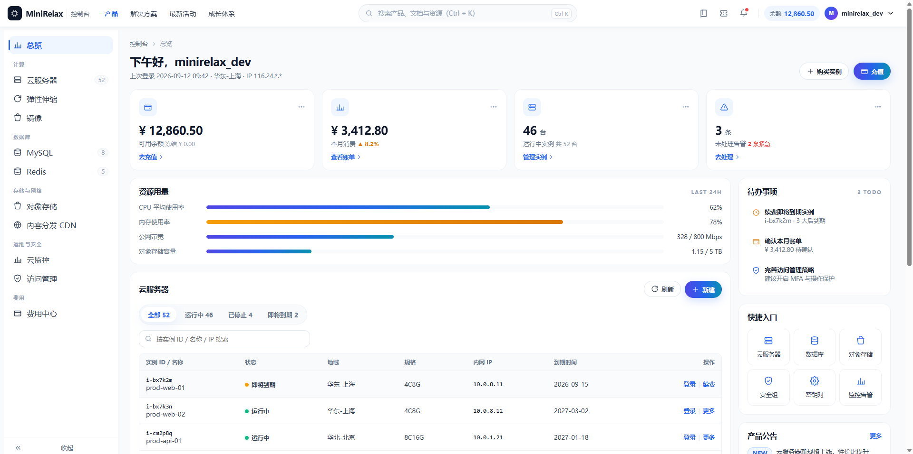

# minirelax-console-design

MiniRelax 品牌控制台（用户中心 / 云控制台 / 管理后台 / 数据面板类页面）的视觉语言与实现规范，以 Agent Skill 形式封装。

一句话定调：**专业、可信赖、克制、数据密度友好，与 MiniRelax 落地页同一套品牌体系。**

## 包含内容

```
minirelax-console-design/
├── SKILL.md                            # 技能入口：适用场景、工作流、关键数值速查
├── assets/
│   ├── tokens.css                      # 设计变量：色彩 / 文字层级 / 圆角 / 阴影 / 动效
│   └── console.css                     # 顶栏 / 侧边栏产品树 / 概览卡 / 数据表格 / 浮层 / 费用组件
├── references/
│   ├── design-tokens.md                # 全局系统规范说明
│   ├── chrome.md                       # 顶栏与侧边栏（产品树、面包屑、搜索、账户区）
│   ├── content.md                      # 内容区块：概览卡、数据表格、费用组件等
│   ├── overlays.md                     # 浮层：抽屉、弹窗、下拉、Toast
│   └── redlines-and-templates.md       # 红线清单 + 使用模板
└── scripts/
    └── check_redlines.py               # 红线静态自检脚本（Python 3，无第三方依赖）
```

## 使用方式

**方式一：Agent Skills 环境（WorkBuddy / Claude Code 等）**

将 `minirelax-console-design/` 目录放入技能目录（如 `~/.workbuddy/skills/`），Agent 会按 `SKILL.md` 的触发条件在"设计/移植/续写/评审用户中心或管理后台页面"时自动加载。

**方式二：作为设计规范文档直接使用**

不接 Agent 也可以直接阅读：

1. `SKILL.md` — 先看这里的"何时使用"与关键数值速查；
2. `references/design-tokens.md` + `assets/tokens.css` — 颜色只走变量，不要自造色值；
3. `references/chrome.md` / `content.md` / `overlays.md` — 按要做的部分查对应章节；
4. 写完用 `scripts/check_redlines.py` 自检。

红线自检脚本用法：

```bash
python scripts/check_redlines.py <目录或文件> [更多路径...] [--quiet]
# 退出码：发现错误级违规返回 1，否则 0
```

## 预览图
<p align="center">
  
</p>


## 红线（摘要，完整版见 references/redlines-and-templates.md）

- 颜色全部来自变量表，新增色必须先注册；
- 禁 `transition: all`，只过渡 opacity / transform / border-color / color；
- 禁黑色重阴影，一律蓝主色系「大距离 + 低透明度」；
- 数据表格数字用 `font-variant-numeric: tabular-nums`；
- 移动端 fixed 底部元素必须处理 `env(safe-area-inset-bottom)`。

## 相关技能

- **minirelax-landing-design**：同一品牌的落地页 / 官网首页规范，与本技能共享色彩与组件语言，建议配套使用。

## 环境

- CSS / 文档：无任何运行时依赖
- `scripts/check_redlines.py`：Python 3.8+，仅标准库
